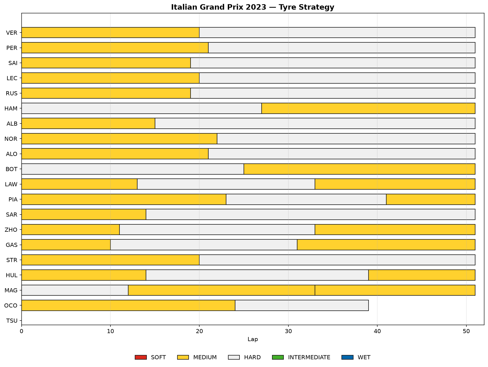

# F1 Strategy Analyzer

A tool that takes any completed Formula 1 Grand Prix and breaks down what actually happened strategically — who pitted when, which tyre strategies worked, and how each driver's pace evolved over the race. It answers questions like *"why did Verstappen pull away from Pérez despite similar early pace?"*



*Every driver's tyre strategy for the 2023 Italian Grand Prix — stint length and compound at a glance.*

## What it does

Given a year, event, and session, the analyzer pulls full lap-by-lap data via [FastF1](https://github.com/theOehrly/Fast-F1) and produces:

1. **Stint visualization** — a strategy chart (above) showing every driver's tyre compounds, stint lengths, and pit stops.
2. **Pace degradation analysis** — fits a linear trend to clean laps within each stint to estimate tyre degradation in seconds/lap, per compound and per driver.
3. **Race pace comparison** — rolling-average lap time between two or more drivers, with pit stops and pace "crossovers" (where the faster driver flips) annotated.
4. **Pit stop summary** — a table of every stop: stationary time, position gained/lost, and estimated race-time cost relative to staying out.

## Setup

```bash
python3 -m venv .venv
source .venv/bin/activate
pip install -r requirements.txt
```

FastF1 caches session data locally after the first download, so re-running an analysis on the same race is fast and works offline. The cache directory (`cache/`) is gitignored — it's rebuilt automatically on first use and can grow to 100MB+ per race.

## Usage

Each core feature has a standalone script under `scripts/`. Edit the `YEAR` / `EVENT` / `DRIVERS` constants at the top of a script to point it at a different race:

```bash
python3 scripts/generate_stint_chart.py      # strategy chart -> output/stint_chart_<year>_<event>.png
python3 scripts/analyze_degradation.py       # degradation chart + printed summary
python3 scripts/compare_pace.py              # pace comparison chart + crossover laps
python3 scripts/pit_stop_summary.py          # pit stop table -> output/pitstops_<year>_<event>.csv
python3 scripts/whatif_strategy.py           # strategy what-if: actual vs. hypothetical stop counts
python3 scripts/season_trend.py              # multi-race view: one driver's strategy across several rounds
```

Run the test suite (uses the same cached session data):

```bash
python3 -m pytest tests/ -v
```

## Methodology notes

**Lap cleaning.** Degradation and pace analysis both need to exclude laps that don't reflect genuine pace: pit in/out laps, laps run under Safety Car / VSC / yellow flags (detected via FastF1's `TrackStatus` codes, which concatenate every status active during the lap), and laps FastF1 itself flags as inaccurate or deleted. This filtering (`src/data/cleaning.py`) is applied before any trend fitting — skipping it produces wildly wrong degradation numbers, since an in-lap or SC lap can be 10-20+ seconds off normal pace and dominates a small least-squares fit.

**Degradation model.** For each stint, lap time (seconds) is fit linearly against `TyreLife` (laps on that set of tyres) using clean laps only. Stints with fewer than 3 clean laps are skipped — not enough points for a meaningful trend. The slope is the estimated degradation in seconds/lap. This is a simple model: it doesn't account for fuel load (which decreases lap time as the race goes on, partially offsetting tyre wear) or track evolution, so absolute degradation numbers should be read as relative comparisons between compounds/drivers rather than precise physical wear rates.

**Race pace comparison.** Unlike the degradation model, this intentionally keeps Safety Car laps in the rolling average — the goal is to show what actually happened on track (who was managing tyres, who was pushing), not idealized clean-air pace. Only pit in/out laps are dropped, since their length is dominated by pit lane transit rather than pace. "Crossover" points (where the faster driver switches) are filtered with a minimum lap gap between crossovers — without it, a short rolling window produces rapid, meaningless flips when two drivers are running near-identical pace.

**Pit stop time loss.** Stationary time comes directly from `PitOutTime - PitInTime`. The more interesting number — time lost relative to staying out — is modeled as `(in-lap time - median clean lap time) + (out-lap time - median clean lap time)`: the combined cost, in race time, of the slow in-lap and slow out-lap versus an idealized lap where the driver just kept circulating at normal pace. This captures more than the raw pit lane delta (which undercounts the entry/exit pace loss) without requiring a full physics model of pit lane speed limits.

**Edge cases.** A driver who retires mid-pit-stop (see OCO, 2023 Monza, lap 39) has an in-lap but no out-lap — `position_after` and `time_lost_s` correctly come back as `None` rather than a fabricated value. A driver marked "Did Not Start" (see TSU, same race) has zero laps and renders as an empty row on the stint chart rather than being dropped silently.

**Strategy what-if (stretch).** Given a hypothetical strategy — a list of `(compound, stint_length)` pairs — `src/analysis/whatif.py` predicts total race time by summing `intercept + slope * tyre_age` (from the driver's own fitted degradation model, falling back to the field-wide average for compounds the driver never actually raced on) across every stint, plus the field-wide average pit loss per stop. As a self-consistency check, replaying a driver's *actual* stint lengths and compounds reproduces their real total race time to within a second. This model has no concept of traffic, safety car timing, or track position, so it can say whether a strategy family was faster *on pure pace* but not whether it would have won the race — an undercut's real value, for instance, comes from the position it gains, which isn't modeled at all.

**Multi-race views (stretch).** `src/analysis/season.py` loops the existing per-race analysis (stints, degradation) across a list of events for one driver, so strategy and tyre management can be compared round-to-round. Two things worth knowing: FastF1 fuzzy-matches event name strings against the season schedule, so a typo'd or garbled name can silently resolve to *some* real event instead of raising an error — `summarize_driver_season` treats a genuinely unresolvable request (e.g. an out-of-range round number) as skippable rather than aborting the whole season summary, but it can't catch a *wrong-but-resolvable* name. Also, "average degradation" across a whole race can come out negative — this isn't a data error, it reflects a driver whose lap times got faster over a stint (e.g. clearing traffic after a poor qualifying) outweighing genuine tyre wear, as seen in VER's 2023 Singapore race below.

## Example findings — 2023 Italian Grand Prix

- **Degradation was low across the board**: Medium averaged +0.023 s/lap, Hard +0.026 s/lap field-wide — consistent with Monza's low-abrasion surface and why most of the field ran a single stop.
- **Pit stops cost ~24-26s** of race time for most drivers (Monza has one of the shortest pit lanes on the calendar); Piastri's lap-41 stop was a clear outlier at ~34s lost.
- **VER vs. PER pace comparison** shows six genuine lead changes in relative pace across the race, with Verstappen fading on old hards in the final laps while Pérez — who pitted a lap later — held stronger late pace.
- **What-if: would a two-stop have beaten VER's actual one-stop?** No — the simulator predicts a two-stop (M17/H17/H17) would have cost an extra ~11 seconds of race time versus the actual M20/H31 one-stop, since Monza's low degradation doesn't offset the cost of a second ~24s pit stop. This matches the real strategic consensus for that race.
- **Season view: VER, Monza vs. Singapore 2023.** Monza (P1, one-stop) showed positive degradation (+0.044 s/lap) as expected on a normal race. Singapore (P5, one-stop) showed *negative* average degradation (-0.023 s/lap) — VER recovered from a poor qualifying and got progressively faster as he cleared traffic, which outweighs any real tyre wear in the average. A reminder that "average stint degradation" conflates two effects (tyre wear vs. traffic/track position) that a single linear fit can't separate.

## Project structure

```
f1-strategy-analyzer/
├── src/
│   ├── data/        # FastF1 loading, caching, lap cleaning
│   ├── analysis/    # degradation model, pace calcs, pit stop modeling
│   └── viz/         # chart builders (stint, degradation, pace)
├── scripts/         # runnable entry points for each analysis
├── tests/           # pytest suite, validated against real race data
├── output/          # generated charts and tables
└── requirements.txt
```

## Roadmap

- [x] **Strategy "what-if"** — use the degradation + pit loss models to estimate whether an alternate strategy would have been faster. See `scripts/whatif_strategy.py`.
- [x] **Multi-race views** — track how a driver's strategy and tyre management evolve across a season. See `scripts/season_trend.py`.
- [ ] **Web frontend** — FastAPI + React app with race/driver pickers, wrapping the existing analysis modules.
